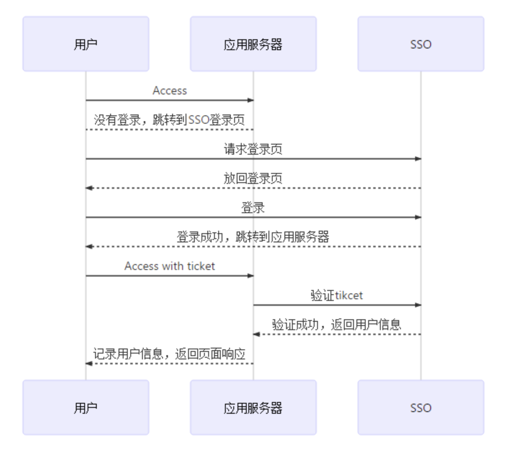
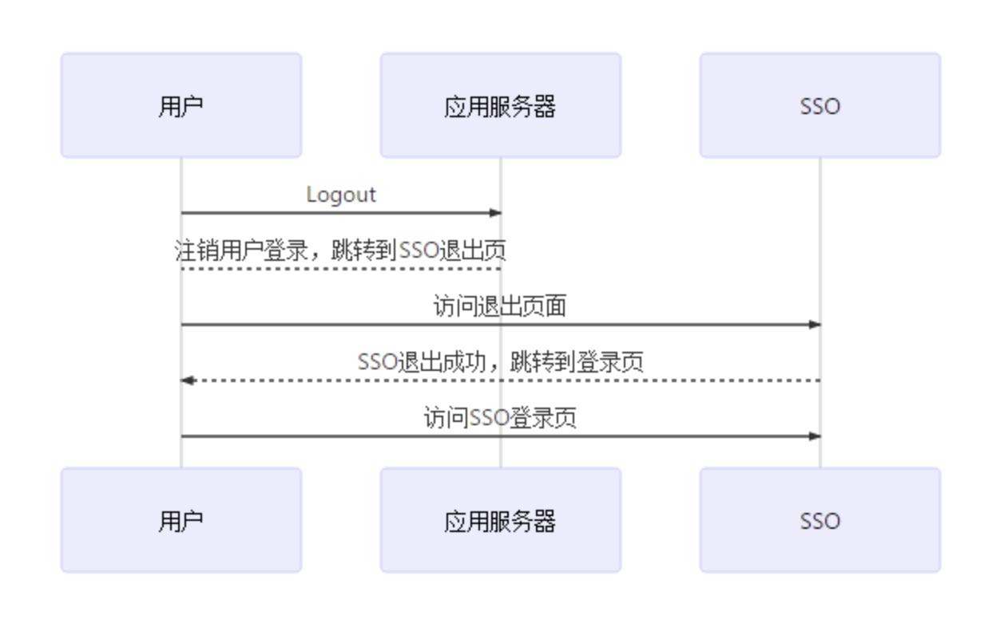

## 开发

```
yarn dev
```

注：prettier 会对格式进行校验，控制台中显示警告信息。commit 时自动格式化，但建议开发人员尽量自己手动修改警告。

## 构建

```
yarn build
```

## 后端服务

```
cd server
yarn app
或者
pm2 start ecosystem.config.js --env production
```

## 提交代码

```
yarn commit
```

## 生成 changelog

```
yarn changelog
```

## 登录验证



- 1、用户请求前端页面
- 2、接口请求数据前通过中间件先判断指定 cookie 是否存在，若存在则已登陆，直接获取数据。不存在，则返回 401 错误码。
- 3、前端根据接口 401 错误码，跳转 sso 登录页，附加 backup URL 参数用于登录后回跳。sso 登录成功后返回 ticket
- 4、backup URL 为应用服务器登录接口，获取到 ticket 后访问 sso validte，获取到登录用户信息
- 5、301 到前端页面，展示用户登录信息



## 目录结构

```
├── CHANGELOG.md
├── README.md
├── deploy.sh
├── index.html
├── package.json
├── postcss.config.js
├── public
│   ├── appinfo.json
│   ├── favicon.ico
│   └── vconsole.min.js
├── server
│   ├── app.js
│   ├── controllers.js
│   ├── db
│   │   ├── db.json
│   │   ├── default.json
│   │   └── index.mjs
│   ├── middleware
│   │   ├── cors.js
│   │   └── res.js
│   ├── router.js
│   └── services.js
├── src
│   ├── App.vue
│   ├── api
│   │   └── developer.ts
│   ├── assets
│   │   ├── arrow.png
│   │   ├── branch.png
│   │   ├── client.png
│   │   ├── code.png
│   │   ├── commit.png
│   │   ├── editor.png
│   │   ├── kaoyue.png
│   │   ├── logo.png
│   │   ├── sendlog.png
│   │   ├── tools.png
│   │   ├── zhiliang.png
│   │   ├── ziyuan.png
│   │   ├── zujian.png
│   │   └── zuoye.png
│   ├── components
│   │   ├── Header.vue
│   │   └── container
│   │       ├── Aside.vue
│   │       ├── Container.vue
│   │       ├── Footer.vue
│   │       ├── Header.vue
│   │       └── Main.vue
│   ├── env.d.ts
│   ├── layouts
│   │   ├── Empty.vue
│   │   └── LayoutDefault.vue
│   ├── main.ts
│   ├── pages
│   │   ├── about
│   │   │   └── AboutPage.vue
│   │   └── home
│   │       ├── Home.vue
│   │       ├── components
│   │       ├── data
│   │       └── model
│   ├── router
│   │   └── index.ts
│   ├── store
│   │   └── index.ts
│   ├── style.scss
│   ├── styles
│   │   └── reset.scss
│   ├── types
│   │   └── global.d.ts
│   └── widgets
│       ├── request.ts
│       └── utils.ts
├── tsconfig.json
├── tsconfig.node.json
├── vite.config.ts
├── yarn-error.log
└── yarn.lock
```
